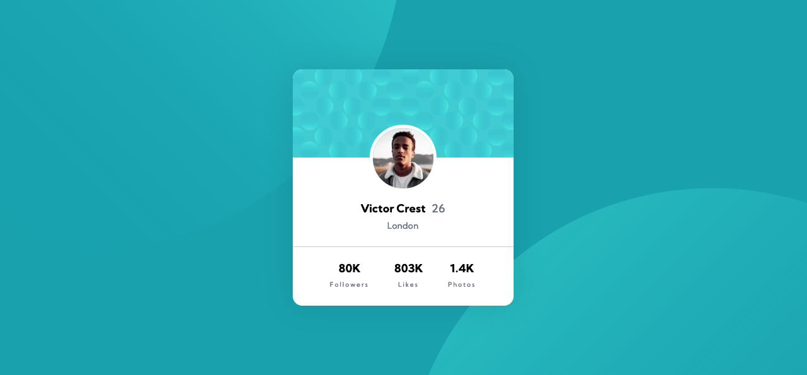
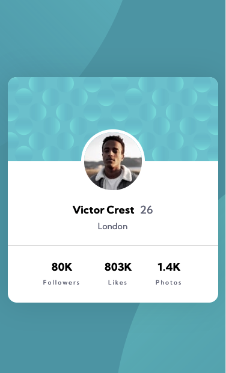

# Frontend Mentor - Profile card component solution

This is a solution to the [Profile card component challenge on Frontend Mentor](https://www.frontendmentor.io/challenges/profile-card-component-cfArpWshJ). Frontend Mentor challenges help you improve your coding skills by building realistic projects.

## Table of contents

- [Overview](#overview)
  - [The challenge](#the-challenge)
  - [Screenshot](#screenshot)
  - [Links](#links)
- [My process](#my-process)
  - [Built with](#built-with)
  - [What I learned](#what-i-learned)
  - [Continued development](#continued-development)
  - [Useful resources](#useful-resources)
- [Author](#author)

## Overview

Built a profile card with a simple background theme.

### The challenge

- Build out the project to the designs provided

### Screenshot

### Links

- Live Site URL: [Live Site Demo](https:profilecardcomponent.netlify.app)

## My process

Began with setting up all of the files that I would need. That includes my styles folder and all of the SCSS and CSS files. Then I started working on the index.html file by adding all the necessary sections I think I'll need for this project and if I realize I'm missing something later on, I'll add it then. Afterwards, I start working on styling the component taking a top-down approach.

### Built with

- Semantic HTML5 markup
- CSS custom properties
- Flexbox
- Desktop-first workflow

### What I learned

In this project there wasn't anything new that I learned but I did get a better practice working on the simple things.

### Continued development

Hopefully on later projects I'll start adding animations and psuedo elements.

## Author

- Website - [Alfonso Pruneda](https://alfonsopruneda.netlify.app)
- Frontend Mentor - [@915fonzie](https://www.frontendmentor.io/profile/915fonzie)
- Twitter - [@915fonzie](https://www.twitter.com/915fonzie)
